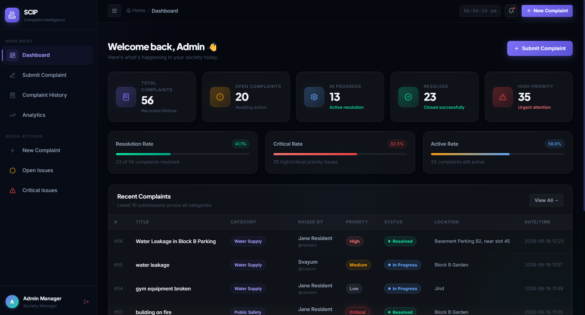
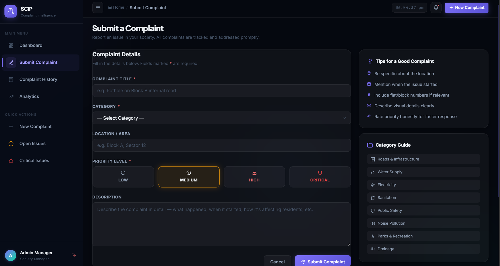
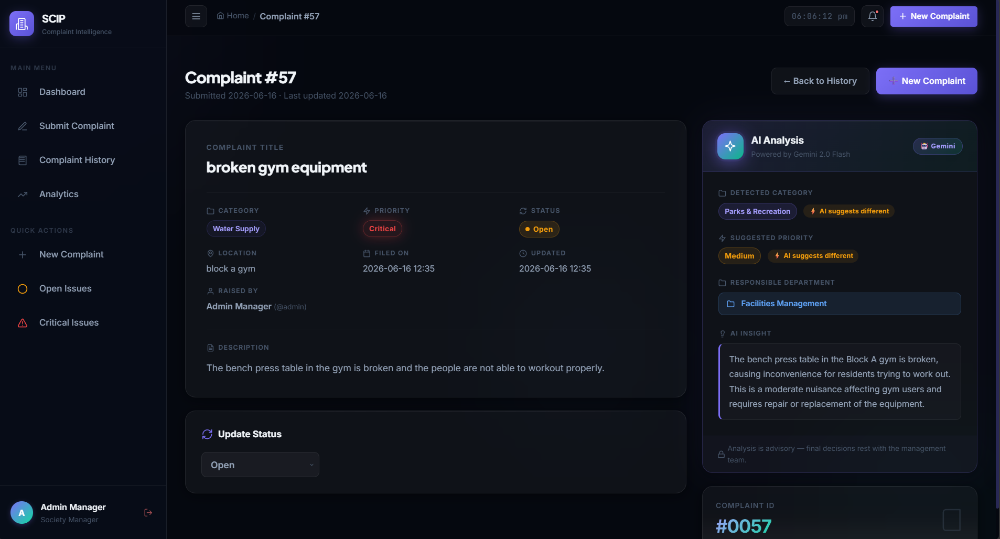
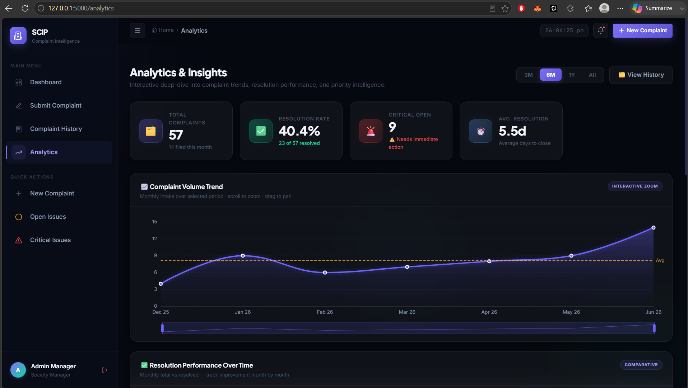

# Smart Complaint Intelligence Platform

## Overview

Smart Complaint Intelligence Platform is an AI-powered complaint management system designed to streamline the complaint handling process in organizations such as colleges, residential societies, offices, and institutions.

The platform automatically analyzes complaints, categorizes them, assigns priority levels, and provides actionable insights through an interactive analytics dashboard.

---

## Problem Statement

Traditional complaint management systems often rely on manual review and categorization of complaints, resulting in:

* Delayed response times
* Misclassification of complaints
* Lack of prioritization
* Poor tracking and reporting

This project aims to solve these challenges using Artificial Intelligence and data-driven analytics.

---

## Key Features

### Complaint Management

* Submit complaints through a user-friendly interface
* Store complaint records in a centralized database
* Track complaint status and history

### AI-Powered Analysis

* Automatic complaint categorization
* Priority detection (Low, Medium, High)
* Department recommendation based on complaint content

### Analytics Dashboard

* Total complaints overview
* Open vs Resolved complaints
* Complaint category distribution
* Priority-based analytics
* Complaint trend monitoring

---

## System Workflow

1. User submits a complaint
2. Complaint text is processed by the AI module
3. AI determines:

   * Category
   * Priority
   * Responsible Department
4. Results are stored in SQLite database
5. Dashboard updates with latest complaint statistics

---

## Tech Stack

| Layer         | Technology            |
| ------------- | --------------------- |
| Frontend      | HTML, CSS, JavaScript |
| Backend       | Flask                 |
| Database      | SQLite                |
| AI Processing | Gemini API            |
| Language      | Python                |

---

## Project Structure

```text
smart-complaint-intelligence-platform/
│
├── app.py
├── ai_analysis.py
├── database.py
├── requirements.txt
├── templates/
└── static/
```

## Future Enhancements

* Email notifications
* User authentication
* Role-based access control
* Real-time complaint monitoring
* Mobile application support
* Advanced AI-driven insights

## Screenshots

### Dashboard



### Submit Complaint



### AI Analysis



### Analytics Dashboard




## Author

Svayum
